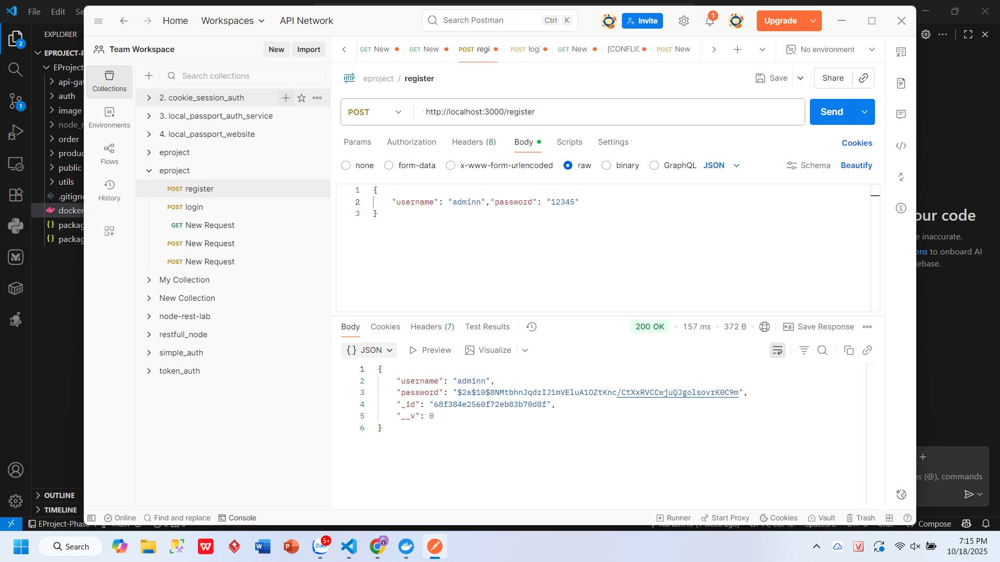
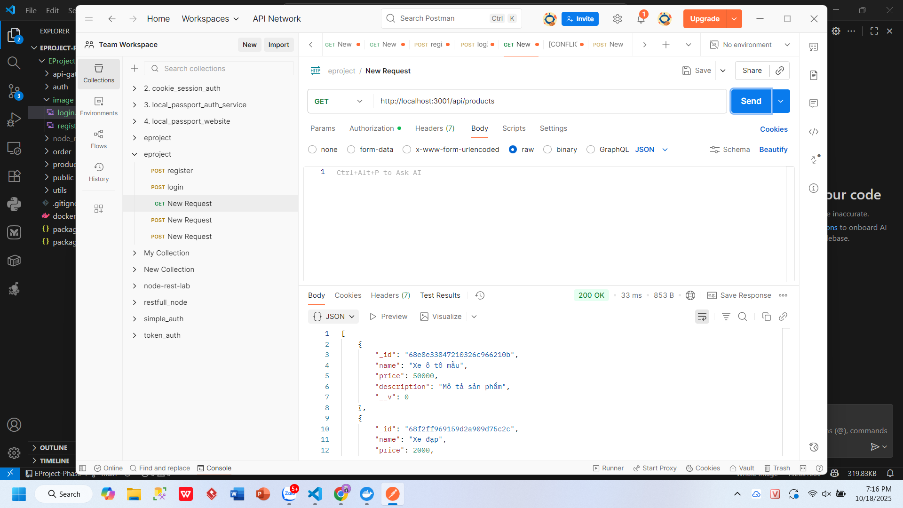
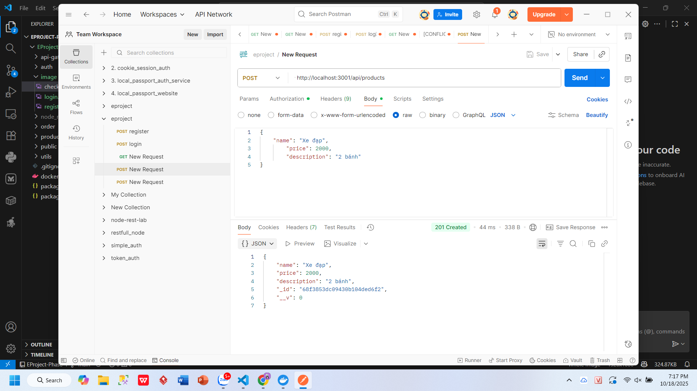
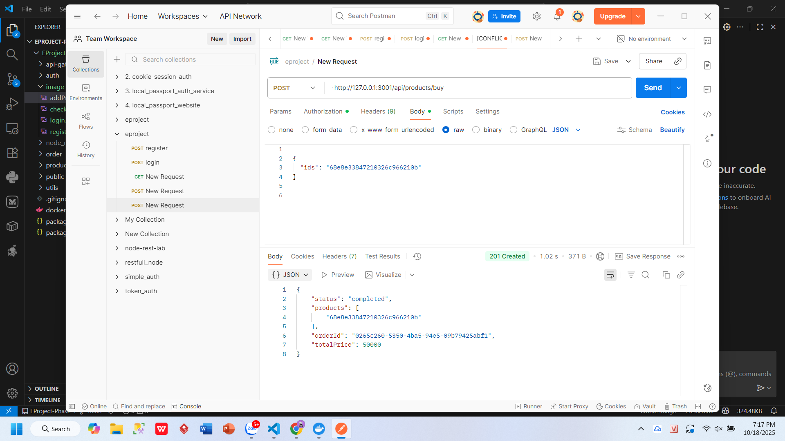

# 🚀 Mô tả quy trình hoạt động dự án Node.js

**1. Hệ thống giải quyết vấn đề gì:**  
Giải quyết bài toán **mua bán sản phẩm trực tuyến**, giúp người dùng có thể đăng ký, đăng nhập, xem, thêm và mua sản phẩm dễ dàng.  

**2. Hệ thống có bao nhiêu dịch vụ:**  
Gồm **4 dịch vụ chính**: `api-gateway`, `auth`, `product`, `order` (cùng hạ tầng MongoDB và RabbitMQ).  

**3. Ý nghĩa từng dịch vụ:**  
- **api-gateway:** cổng vào hệ thống, định tuyến và kiểm tra token.  
- **auth:** xử lý đăng ký, đăng nhập và xác thực người dùng.  
- **product:** quản lý thông tin sản phẩm.  
- **order:** xử lý đơn hàng và lưu lịch sử mua hàng.  

**4. Các mẫu thiết kế được sử dụng:**  
Áp dụng **Microservices**, **API Gateway pattern**, **Repository pattern**, và **Message Queue (RabbitMQ)** để đảm bảo hệ thống tách biệt, dễ mở rộng.  

**5. Các dịch vụ giao tiếp thế nào:**  
Các service **giao tiếp qua API Gateway** bằng **REST API**, và một số tiến trình nội bộ (như tạo đơn hàng → cập nhật kho) dùng **RabbitMQ** để truyền thông điệp bất đồng bộ.  

---

## 🧩 1. Đăng ký tài khoản (Register)
Người dùng tạo tài khoản mới bằng cách cung cấp thông tin cần thiết.  
Sau khi đăng ký thành công, thông tin người dùng được lưu vào cơ sở dữ liệu.  

---

## 🔐 2. Đăng nhập hệ thống (Login)
Người dùng sử dụng tài khoản đã đăng ký để đăng nhập.  
Hệ thống kiểm tra thông tin đăng nhập và tạo token xác thực cho phiên làm việc.  

---

## ✅ 3. Kiểm tra thông tin người dùng (Check)
Sau khi đăng nhập, người dùng có thể kiểm tra thông tin cá nhân hoặc trạng thái tài khoản.  
Chức năng này xác minh token và phản hồi thông tin hợp lệ.  

---

## ➕ 4. Thêm sản phẩm (Add Product)
Người dùng có quyền thêm sản phẩm mới vào hệ thống.  
Sản phẩm bao gồm các thông tin cơ bản như tên, giá, mô tả và hình ảnh.  

---

## 💳 5. Mua sản phẩm (Buy Product)
Người dùng chọn sản phẩm muốn mua và tiến hành thanh toán.  
Hệ thống cập nhật đơn hàng và lưu lịch sử giao dịch.  

---

## 🧠 Tổng kết
Toàn bộ quy trình hoạt động thể hiện luồng người dùng cơ bản trong ứng dụng Node.js:  
1. Đăng ký → 2. Đăng nhập → 3. Kiểm tra → 4. Thêm sản phẩm → 5. Mua hàng  
Giúp đảm bảo người dùng có thể thao tác đầy đủ trong hệ thống mua bán trực tuyến.
